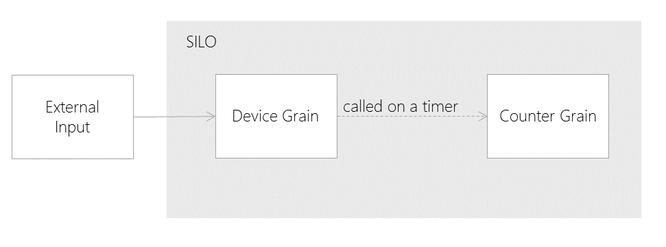

# Orleans Cadence Pattern

## Intent

Decouple the rhythm of grain interactions from external input using timers

## Also Known As

## Motivation

A peak burst of calls into outside the system could result in an avalanche of messages flowing through the grains and silos. Grains buffer the data and only pass it on to other grains at fixed intervals, using timer ticks at set intervals.     

## Applicability

The cadence pattern can be used when grains accepts messages from external sources, where the frequency can vary and peak activity could disrupt the stability of the system.

It could also be used to to control flow from out of Orleans into an external system, such as monitoring or collation.

Often used with aggregator or reduce pattern.      

## Structure



## Participants

## Collaborations

## Consequences

## Implementation

Orleans supports timers that enable developers to specify periodic behavior for grains. They are subject to single threaded execution guarantees within the grain activation, which is key to Orleans.  

The timers are typically set in the grain's ActivateAsync() call, using RegisterTimer(asyncCallbackFunction, object anyState, TimeSpan startTime, TimeSpan tickPeriod)

## Sample Code

The timer is typically set up in the grain's ActivateAsync() call

```cs
public override Task ActivateAsync()
{
    RegisterTimer(SendUpdate, null, TimeSpan.FromSeconds(1, TimeSpan.FromSeconds(5));

```

The grain buffers incoming data 

```cs
public Task TrackCurrentOutputLevel(long latestOutputLevel)
{
 	_outputRunningTotal += latestOutputLevel;
```

SendUpdate is called on each timer tick, and checks if there is new buffered data to send before making its call

```cs
async Task SendUpdate(object _)
{
    if (_outputRunningTotal == 0)
        return;  // nothing to send

    await _counterGrain.TrackOutputLevel(_outputRunningTotal);
```

## Known Issues

## Related Patterns

