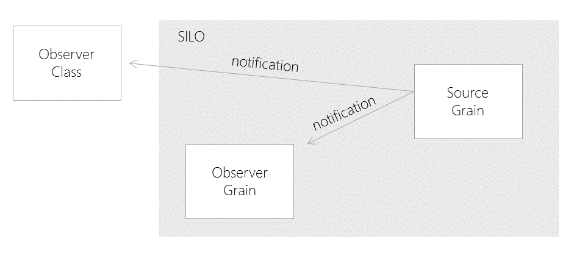

# Orleans Observer Pattern

## Intent

Allows an observer to be notified of any state changes that a grain can choose to publish

## Also Known As

Pub/Sub, Events

## Motivation

The observer pattern is a well known software design pattern in which an object, called the subject, maintains a list of interested parties, called observers, and notifies them automatically of any state changes, usually by calling one of their methods. Because this pattern is so well established, Orleans supports it natively, along with helper classes to aid implementation. 

## Applicability

You would use the Observer pattern when want a grain to allow subscribers to register their interest in specific events.   

## Structure

## Participants

The subject (aka observed, source) grain

The observer (aka watcher, sink) grain or class

## Collaborations

The source grain will notify all observers via an interface method as and when it has updates and information it wishes to share.  

The observer must explicitly set up a subscription when it wishes to receive updates, providing a link to itself if it is a grain, or a proxy if it is not a grain. It should also explicitly cancel the subscription when it no longer requires updates.    

## Consequences

## Implementation

A grain type that supports observation will define an observer interface that inherits from the IGrainObserver interface. Methods on this observer interface correspond to events that the observed grain makes available. 

An observer implements this interface and then subscribe to notifications from a particular grain. The observed grain would call back to the observer through the observer interface methods when an event has occurred.

Methods on observer interfaces must be void since event messages are one-way. If the observer needs to interact with the observed grain as a result of a notification, it must do so by invoking normal methods on the observed grain.

The observed grain type must expose a method to allow observers to subscribe to event notifications from a grain. In addition, it is usually convenient to expose a method that allows an existing subscription to be canceled. Grain developers may use the Orleans ObserverSubscriptionManager<T> class to simplify the subscriptions and notifications.

If the observer is not a grain, it must first create a local C# class that implements the observer interface, then call a static method on the observer factory, CreateObjectReference(), to turn the C# object into a grain reference, which can then be passed to the subscription method on the notifying grain. 

## Sample Code

## Known Issues

## Related Patterns

