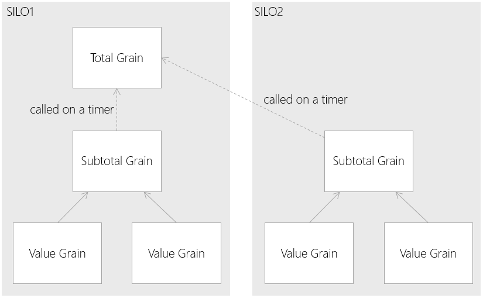

# Orleans Reduce Pattern

## Intent

Provides a hierarchical structure to aggregate a value stored in many grains, which would unachievable with a fan-out.

## Also Known As

## Motivation

A side-effect to isolating state in grains, which are in turn distributed across a cluster of machines is that it is hard to retrieve an aggregate, for example a total, or average of a variable held by the grain.

A fan-out could be used to retrieve the value from a small number of grains, but approach starts to fail when the number of grains increase. It would also be necessary to know in advance which grains need to participate in the fan-out.

The Reduce approach is for a Singleton grain to record the total value, and for all grains contributing to this value should call this Singleton. The problem with doing this directly is that it introduces a severe performance penalty in the system. It's conceivable that every request to the system could ultimately result in the call to the Singleton, thus turning creating a bottleneck, as the Singleton would be unlikely to cope with the volume of requests. Many of these requests would also cross Silo boundaries, which are expensive.

The Reduce pattern solves this problem by introducing a StatelessWorker grain which is responsible for collecting results in each of the silos. This grain then periodically publishes the number to the Singleton, which may be in a different silo.

## Applicability

Use the Reduce pattern in the following situations:

* You want to aggregate a value, or perform a count over a large number of grains, distributed across silos. For example you want an average, min/max of a value held by all grains.

## Structure

## Participants

## Collaborations

## Consequences

## Implementation

## Sample Code

## Known Issues

## Related Patterns

